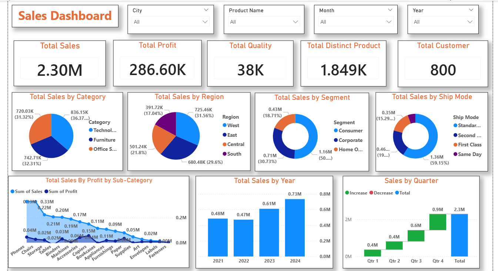

# 📊 Sales Dashboard Project

## 📌 Overview

This project presents an interactive **Sales Dashboard** built using Power BI to analyze sales performance across different regions, products, and time periods.

The dashboard helps in identifying key insights such as top-performing products, sales trends, and regional performance.

---

## 🛠️ Tools & Technologies Used

* Microsoft Power BI
* SQL (for data analysis)
* Data Cleaning & Data Visualization

---

## 📊 Key Features

* 📈 Monthly Sales Trend Analysis
* 🌍 Region-wise Sales Performance
* 🏆 Top Products Identification
* 💰 Revenue Insights
* 📉 Dynamic and Interactive Dashboard

---

## 📷 Dashboard Preview

---

## 📂 Dataset

* The dataset includes sales records such as:

  * Product Name
  * Region
  * Sales Amount
  * Quantity
  * Date

---

## 🔍 Insights Gained

* Identified highest revenue generating products
* Observed seasonal trends in sales
* Compared performance across different regions
* Found areas with low sales for improvement

---

## 🎯 Objective

To build a clean and interactive dashboard that helps businesses make data-driven decisions.

---

## 🚀 How to Use

1. Download the `.pbix` file
2. Open in Power BI 
3. Interact with filters and visuals

---

## 📬 Contact

If you have any questions or feedback, feel free to connect with me.

---
